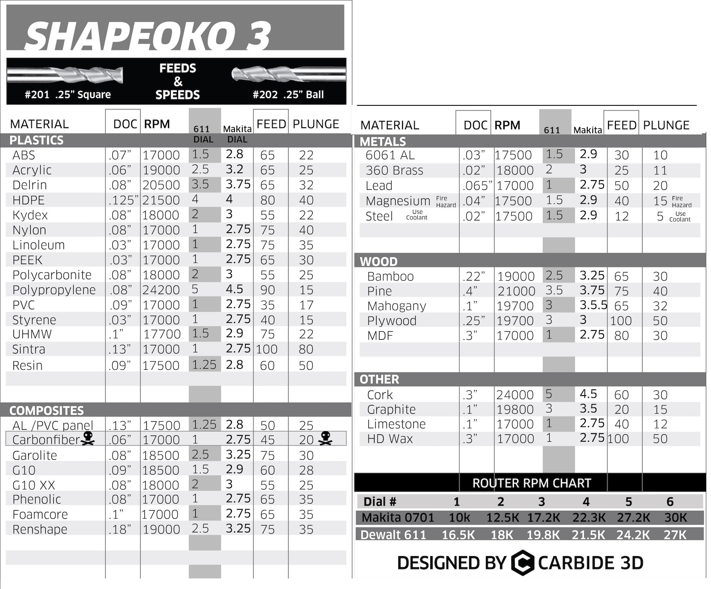

# CNC Projects

This repository contains CNC projects designed for the [Shapeoko 3 XL](https://shop.carbide3d.com/products/shapeoko3?variant=14064088580157). The `c2d` files are meant to be opened using [Carbide Create](https://carbide3d.com/carbidecreate/).

| File                                               | Description                                                                                                                                                                        |
| -------------------------------------------------- | ---------------------------------------------------------------------------------------------------------------------------------------------------------------------------------- |
| `src/chopstick_rests.c2d`                          | A set of chopstick rests, meant as a learning exercise for 3d carving in Carbide Create Pro                                                                                        |
| `src/coasters.c2d`                                 | Coasters of approximately 6" x 6"                                                                                                                                                  |
| `src/dutchman.c2d`                                 | A basic dutchman inlay pattern. Cut an inside contour to create a router template, and an outside contour for the inlay itself                                                     |
| `src/laptop_stand/laptop_stand_orig.c2d`           | The original laptop stand design based on [this](http://www.winstonmoy.com/2016/06/diy-laptop-stand-for-5-in-materials/) design from Winston Moy.                                  |
| `src/laptop_stand/laptop_stand_simplified.c2d`     | My 2019 Macbook Pro connects to its desktop hardware via a single Thunderbolt 3 cable. This is a simplified design with only a single cable guide.                                 |
| `src/lego_drop_tray.c2d`                           | A drop tray for keys/change/etc., shaped like a Lego character.                                                                                                                    |
| `src/push_stick.c2d`                               | Table saw push stick. A band saw must be used to square the inside corner at the heel.                                                                                             |
| `src/ridgid_spindle_sander_wrench.c2d`             | A wrench for loosening the bolt at the top of the spindle of the Ridgid oscillating belt/spindle sander                                                                            |
| `src/serving_boards/serving_board_[1/2/3/4/5].c2d` | A number of different serving board designs.                                                                                                                                       |
| `src/spoon/[back/front].c2d`                       | A 3d-carved spoon. Run `front.c2d` first, and use the resulting dowel holes to align it when flipped. This is easier if the dowel holes are allowed to extend into the wasteboard. |
| `src/tool_trays/tool_tray_[1/2/3].c2d`             | A few different rool tray designs for organizing CNC tools and accessories.                                                                                                        |

## Feeds and Speeds

